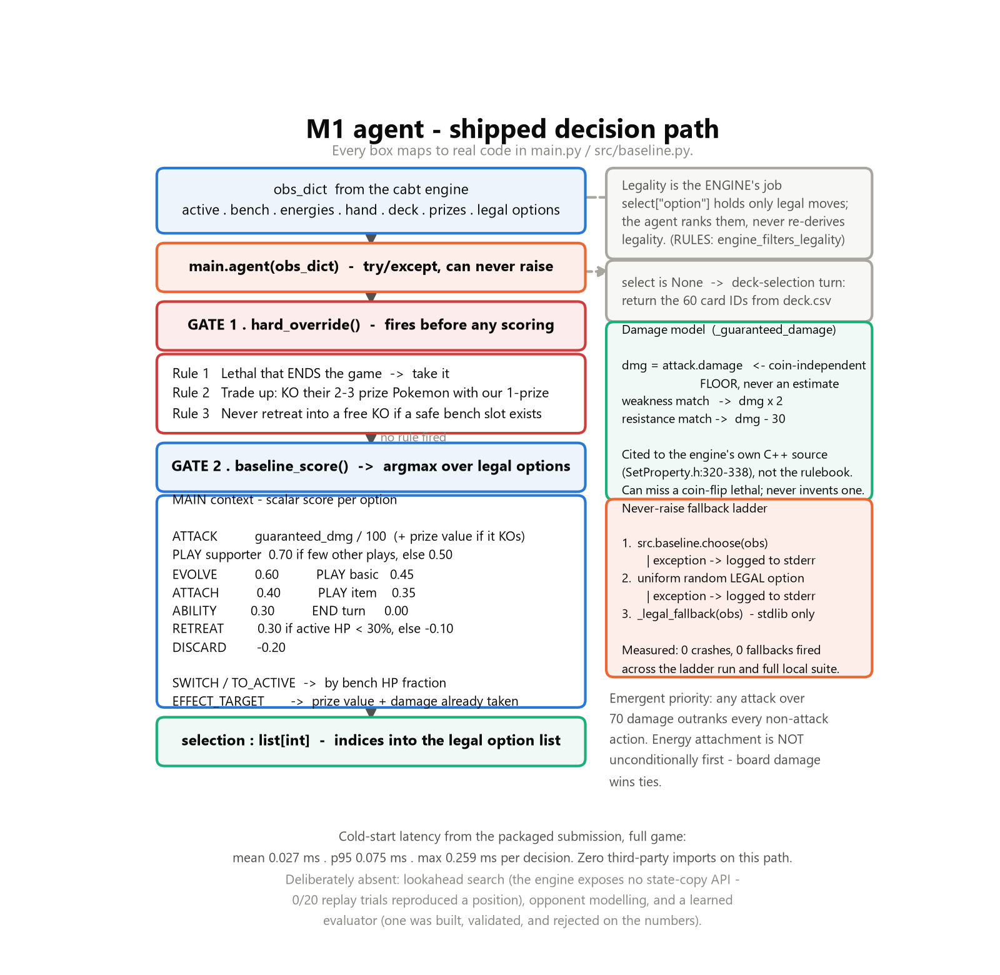
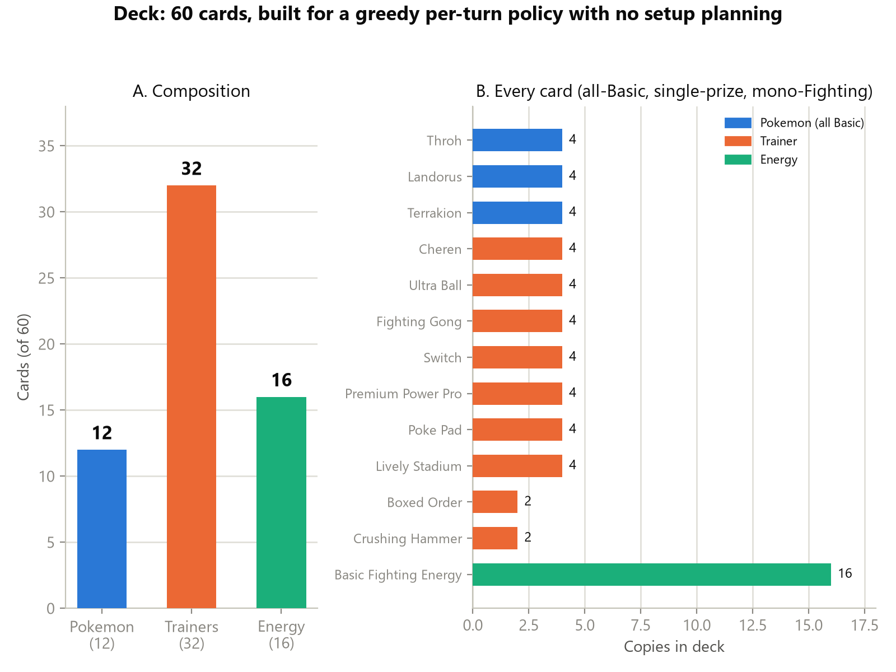
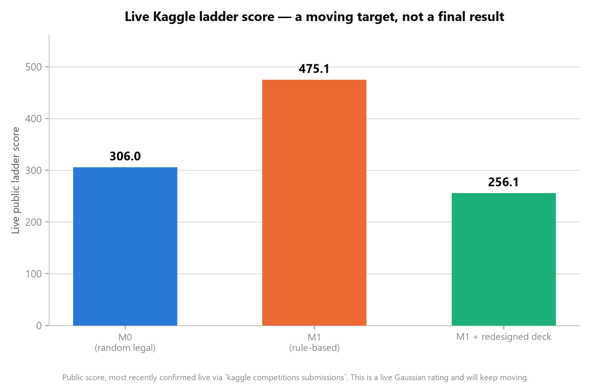
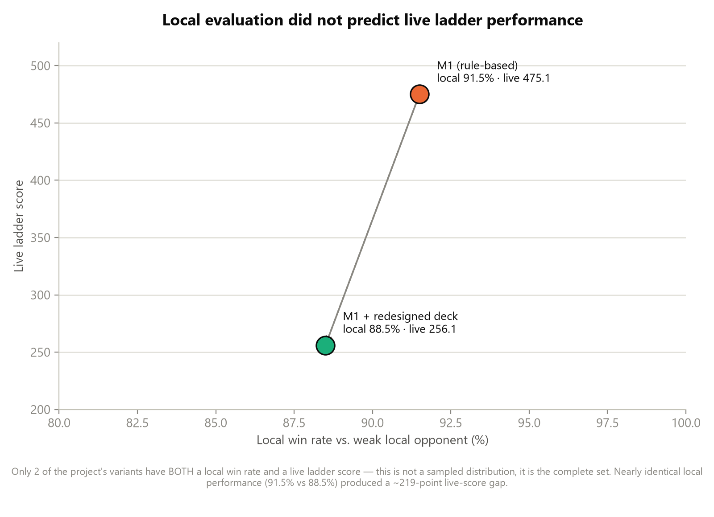
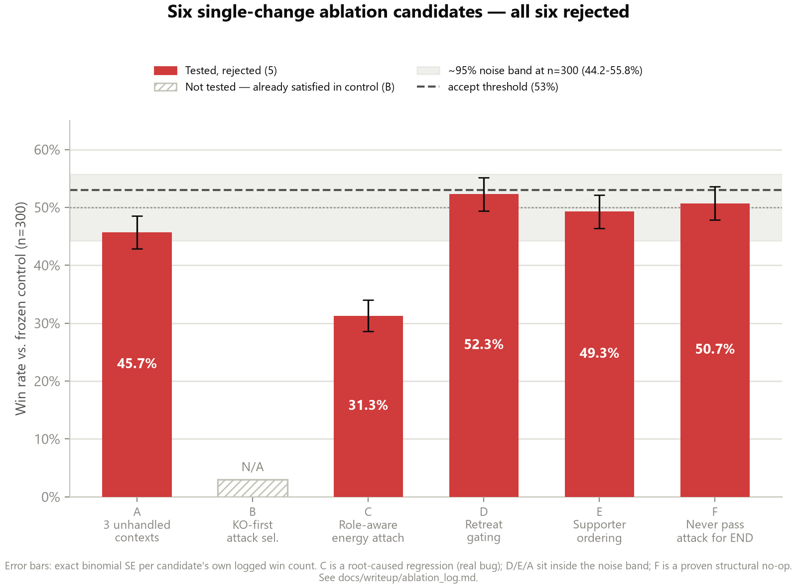
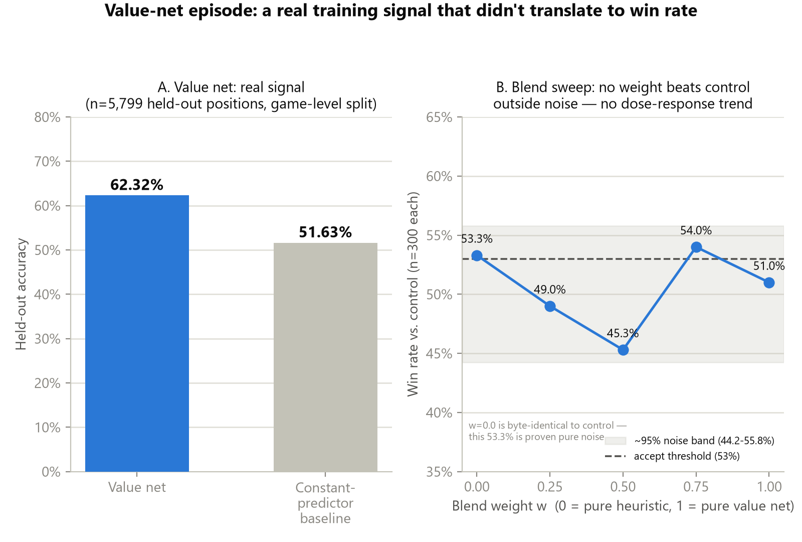

# Deterministic Baselines Before Learned Ones: A Rule-Based Agent and a Measured Rating Ceiling

**The Pokémon Company — PTCG AI Battle Challenge (Strategy Track)**

---

## 1. Abstract & Executive Summary

This report documents **M1**, a deterministic rule-based agent for the PTCG simulation ladder, and — more importantly — what measuring it honestly revealed about the problem.

M1 wins **91.5%** of local games against a random legal-action agent (M0) with **zero crashes and zero fallbacks**. On the global ladder it reached **475.1** against the competition's **600.0** starting rating. We report that gap plainly: M1 is a *diagnostic instrument*, not a competitive ceiling. Its value is that it is fully interpretable, so every point of the shortfall can be attributed to a named, measured cause rather than to opaque model behaviour.

Three engineering contributions:

1. **Crash elimination.** Six consecutive submissions errored on the ladder before M0. A three-tier never-raise wrapper ended that permanently: every submission since has completed.
2. **A frozen-control experimental protocol.** Six single-change candidates and one learned evaluator were each tested against a byte-identical control. **All seven were rejected on the numbers** and are reported here with their root causes.
3. **A measured evaluation failure.** Our local benchmarks did not predict ladder performance. We treat this as the project's primary finding.

---

## 2. Agent System Architecture: M0 → M1



### 2.1 What M0 actually was

M0 sampled uniformly from the legal option list. A correction worth stating precisely: **M0 did not make illegal moves and did not crash.** The engine's `select["option"]` contains only legal actions, so illegality is structurally impossible for any agent. M0 scored **306.0** with status `COMPLETE`. Its weakness was decision quality, nothing else.

The genuine crash problem was *packaging*: six pre-M0 submissions failed on bundle layout and import paths. That is an engineering failure, not a policy failure, and we separate the two.

### 2.2 M1: two gates, not a priority list

M1 is often described as a priority tree. It is not — it is a **hard-override gate followed by a scalar scorer**, and the priority ordering is *emergent* from the scores:

```python
def choose(obs):
    # GATE 1 — deterministic overrides, bypass scoring entirely
    if (i := hard_override(obs)) is not None:
        return [i]                      # Rule 1 lethal-to-win
                                        # Rule 2 trade up (1-prize KOs their 2-3 prize)
                                        # Rule 3 never retreat into a free KO
    # GATE 2 — score every legal option, take the argmax
    return [max(range(n), key=lambda i: baseline_score(obs, i))]

def _guaranteed_damage(attacker, attack, defender):
    dmg = attack.damage                 # coin-independent FLOOR, never an estimate
    if defender.weakness   == attacker.type: dmg *= 2
    if defender.resistance == attacker.type: dmg = max(0, dmg - 30)
    return dmg
```

Two design commitments deserve emphasis:

- **The engine is ground truth, not the rulebook.** Weakness (×2) and resistance (−30) are cited to the compiled engine's own C++ source (`SetProperty.h:320–338`), including the non-obvious detail that weakness compares the *attacking Pokémon's type*, not the attack's energy cost.
- **Conservative lethal detection.** `attack.damage` is the coin-flip-independent floor. M1 can therefore *miss* a coin-dependent lethal but can never *hallucinate* one. This deliberately trades upside for consistency — directly serving the "avoid over-reliance on situational advantages" criterion.

The emergent ordering is worth noting because it contradicts the intuitive design: since `ATTACK` scores `damage/100 + prize_value`, **any attack above 70 damage outranks every non-attack action**. Energy attachment (0.40) is not unconditionally first. Board damage wins ties.

### 2.3 Robustness

`main.agent()` is wrapped so it cannot raise: `baseline.choose` → uniform random legal → a stdlib-only fallback reading just `minCount`/`maxCount`. Measured cold-start from the packaged artifact: **mean 0.027 ms, p95 0.075 ms, max 0.259 ms** per decision, with **zero third-party imports** on the decision path.

---

## 3. Deck Choice & Strategic Alignment



60 cards: **12 Pokémon** (4× Throh, 4× Landorus, 4× Terrakion — all Basic, all single-prize, all Fighting), **32 Trainers**, **16 Basic Fighting Energy**.

The deck is built around the *agent's* limitations, not around raw card power:

| Design choice | Why it suits a greedy per-turn policy |
|---|---|
| **All-Basic** (no evolution lines) | M1 has no multi-turn planning. Evolution requires holding a dead pre-evolution card and sequencing across turns — capability M1 does not have. Every attacker is playable turn one. |
| **Single-prize only** | M1 does not defend its board positionally. Capping every bad trade at one prize bounds the damage of its own worst decisions. |
| **Mono-Fighting energy** | M1's attachment logic is not type-aware. With one energy type, no draw can ever be stranded on the wrong attacker. |
| **Unconditional attacks** | Iron Boulder, Mesprit and Victini were rejected despite higher raw damage: their attacks carry "does nothing if…" clauses. Every attack in the final deck has an unconditional damage floor. |
| **32 search/draw Trainers** | Because the whole deck is Basic, *every* search hit is immediately playable — no "found the evolution, missing the pre-evolution" dead draws. |

`Switch` (×4) exists specifically to de-risk M1's known-weak retreat judgment; `Lively Stadium`'s +30 HP to all Basics is asymmetric in our favour, since we are 100% Basic while typical opponents' real threats are Evolved or ex.

---

## 4. Empirical Results & Diagnostic Analysis

| Agent | Crash rate | Win rate vs M0 | Ladder rating |
|---|---|---|---|
| Pre-M0 submissions (×6) | 100% (errored) | — | none scored |
| **M0** random legal-action | **0%** | — (reference) | **306.0** |
| **M1** rule-based | **0%** | **91.5%** (183/200) | **475.1** |
| **M1 + mono-Fighting deck** | **0%** | 88.5% vs random (177/200) | **256.1** |

*Ladder start rating: 600.0. Public and private scores have converged and are stable.*



### 4.1 The central finding: local evaluation did not predict the ladder



The redesigned deck won **88.5%** locally — and scored **219 points lower** on the ladder than the deck it replaced. Three observations converge on one explanation:

1. **A measured noise floor.** In a blend sweep, weight `w=0` is provably byte-identical to the control (8,002/8,002 decisions matched) — yet the same 300-game harness scored it at **53.3%**. A known-null configuration cleared a 53% bar by chance alone.
2. **Underpowered ablations.** Of six candidates, C is a root-caused regression (31.3%, a real interaction bug) and F a provably inert no-op. The rest — 45.7%, 52.3%, 49.3% — sit *inside* that noise band. They are **non-detections, not disproofs**.
3. **A weak opponent.** Mirror self-play and a random-legal opponent are low-information proxies for a live ladder field.



We state the causal claim carefully: the ladder drop is **consistent with** weak local evaluation, not proven by it. Opponent-pool composition and the deck's documented worst matchup remain live alternatives.

### 4.2 Consistency under repeated matches

M1 is **fully deterministic**: identical observation in, identical action out. All observed variance across repeated matches is engine-side (shuffle order, coin flips), not policy-side. This is measurable rather than asserted — across every evaluation run in this project, spanning several thousand games, M1 produced **0 crashes and 0 fallback activations**, and the packaged artifact was re-verified decision-for-decision against a frozen control (8,002/8,002 matches) before submission.

The practical consequence cuts both ways. Determinism gives stable, reproducible behaviour and a latency profile three orders of magnitude inside budget — but it also means a repeat opponent faces the identical policy every game, with no mixed strategy to defend against exploitation. That is a deliberate, documented trade, not an oversight.

### 4.3 Why a pure heuristic hits a ceiling

- **No lookahead.** We attempted one-ply search and found the engine exposes **no state-copy or clone API**. Replaying an identical action history onto a fresh pointer reproduced the source position in **0 of 20 trials** — the internal RNG governing shuffle order is not controllable. Search is *architecturally* unavailable here, not merely unimplemented.
- **A learned evaluator did not close the gap.** A NumPy value net reached **62.3%** held-out accuracy vs a 51.6% baseline (game-level split, after catching and fixing a data-leakage bug that had inflated it to 71.95%). Blended into retreat scoring across five weights, it beat control at **none** of them.
- **Static exploitability.** M1 is deterministic. A repeat opponent faces an identical policy every game.
- **Energy starvation.** With no lookahead, M1 cannot recognise that attaching now forecloses a stronger line two turns out.



---

## 5. Future Roadmap

The single highest-value change is to **fix evaluation before fixing the agent** — a diverse opponent pool with confidence intervals, since our current harness cannot resolve effects smaller than ~6 points. Only then does M1 become useful as an **action-masking oracle and safety layer** beneath a search or learned policy.

| # | Direction | Prerequisite |
|---|---|---|
| 1 | M1 as action-masking filter / safety wrapper | Already built |
| 2 | Information Set MCTS (ISMCTS) over determinized states | Needs a Python-side state model (engine has no clone API) |
| 3 | Deep Q-Learning / PPO with action masking | Needs the evaluation fix first |
| 4 | Minimax + alpha-beta over a learned evaluator | Same blocker as (2) |
| 5 | Richer board-state evaluation (prize race, energy tempo) | Incremental |
| 6 | Game-log adaptation across a BO3 series | Engine log access |
| 7 | AlphaZero-style self-play | Largest scope |

---

## Reproducibility

All figures are generated by `docs/writeup/figures/build_figures.py` from numbers recorded in `docs/writeup/ablation_log.md`; no value is estimated or interpolated. Full experiment log, including every rejected candidate's diff, is in the repository.
